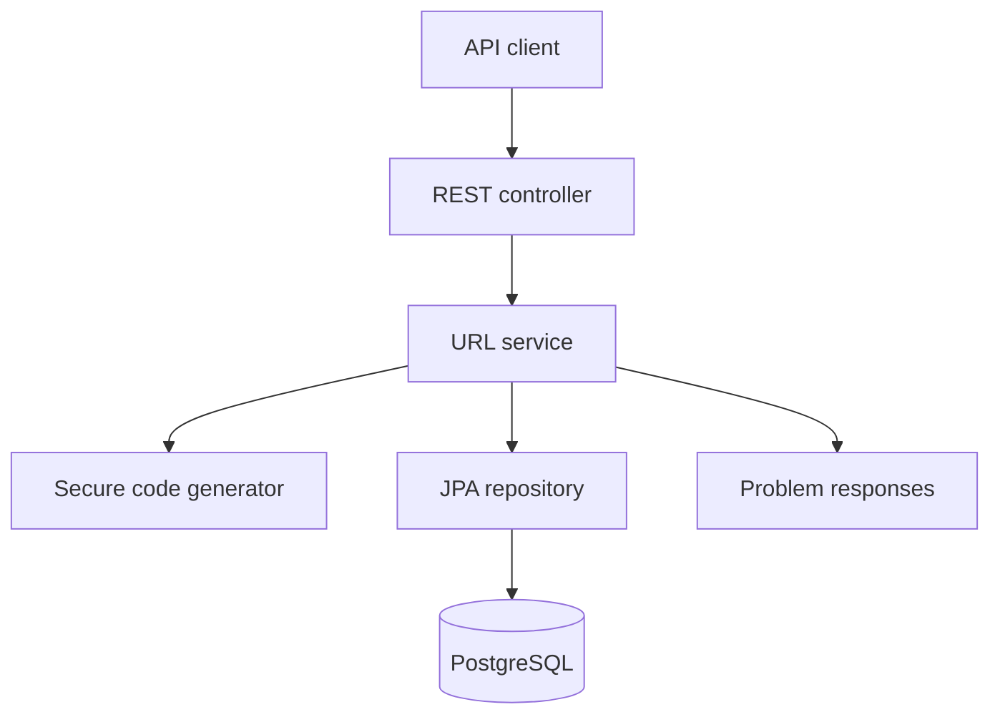

# AI-Assisted URL Shortener

A runnable Spring Boot 3 / Java 17 prototype that turns a loosely stated product request into a reviewable engineering outcome. The repository deliberately includes both the software and the evidence of engineer-led, AI-assisted execution required by the assignment.

## Quick start

Prerequisite: Docker Desktop with Docker Compose.

```bash
docker compose up --build
```

Create a link:

```bash
curl -i -X POST http://localhost:8080/api/v1/urls \
  -H 'Content-Type: application/json' \
  -d '{"originalUrl":"https://example.com/products/123","expiresInDays":30}'
```

Use the returned code:

```bash
curl -i http://localhost:8080/{code}
curl http://localhost:8080/api/v1/urls/{code}/analytics
curl http://localhost:8080/actuator/health
```

Run quality gates locally with Java 17 and Maven 3.9+:

```bash
mvn clean verify
```

Verified status: GitHub Actions run 8 completed `mvn -B clean verify` successfully on Java 17. Four unit tests and two end-to-end integration tests passed with zero failures, errors, or skips. See [docs/CI-VALIDATION.md](docs/CI-VALIDATION.md).

## Behavior

| Case | Result |
|---|---|
| Valid create | `201 Created` and a seven-character Base62 code |
| Existing active code | `302 Found` and atomic click increment |
| Unknown code | `404 Not Found` |
| Expired code | `410 Gone` |
| Invalid/non-HTTP URL | Structured `400 Bad Request` |
| Repeated code collision | Retried up to five times, then `503` |

The service rejects `file:`, `javascript:`, relative URLs, and URLs containing credentials. Redirect targets are not fetched by the server, so the current implementation does not create an SSRF path. Abuse prevention, malware/phishing reputation checks, and authentication belong at the gateway in a public deployment.

## Architecture



- A modular monolith is intentional for a 2-3 day prototype. It has clean seams and avoids distributed-system overhead before scale requires it.
- PostgreSQL is the source of truth. Flyway owns schema evolution.
- A database unique constraint is the final collision guard; each repository write has its own transaction so a failed collision attempt can be safely retried.
- Analytics uses a single atomic SQL update, avoiding lost increments under concurrent redirects.
- UTC `Instant` and an injected `Clock` make expiration deterministic and testable.
- Actuator exposes health/probes. The container runs as a non-root user.

Control flow:

1. `POST /api/v1/urls` validates and normalizes the URL, generates a cryptographically strong random code, persists it, and returns its public URL.
2. `GET /{code}` loads the record, enforces expiration, atomically records access, and sends an HTTP redirect.
3. `GET /api/v1/urls/{code}/analytics` returns deliberately minimal, privacy-conscious aggregate analytics.

The API contract is in [openapi.yaml](openapi.yaml). The schema migration is in `src/main/resources/db/migration`.

## Requirement normalization and assumptions

The original phrase “URL shortener with core APIs, analytics, and reliability features” is ambiguous. The engineer-approved prototype interpretation is:

- Core means create, redirect, and inspect aggregate analytics.
- Analytics means total clicks and last-access time, not IP, identity, geography, referrer, or device tracking.
- Expiration is optional and expressed as 1-3650 days.
- A redirect is counted when the redirect response is produced. Absolute real-time accuracy is not promised across a failed database transaction.
- Anonymous usage is acceptable only for the prototype. Production creation/analytics APIs require authentication, authorization, quotas, and rate limiting.
- Custom aliases, deletion, editing, QR codes, and dashboards are out of scope.

## Task decomposition

| Seq. | Task | Depends on | Acceptance evidence |
|---:|---|---|---|
| 1 | Normalize requirements and threats | - | Assumptions and status semantics documented |
| 2 | Define API and persistence contract | 1 | OpenAPI and Flyway migration |
| 3 | Implement create workflow | 2 | Validation, secure codes, collision retry |
| 4 | Implement redirect and analytics | 2 | 302/404/410; atomic counter |
| 5 | Add error handling and operations | 3, 4 | Stable problem response; health endpoint |
| 6 | Add unit/integration tests | 3-5 | Service edge cases and end-to-end test |
| 7 | Package and document | 1-6 | Docker Compose and review packet |

## Three required scenarios

### 1. Greenfield - build the core service

Intent: turn a URL into a compact link and resolve it reliably.

Execution: define API -> model schema -> implement validation/generation/persistence -> implement redirect -> test happy and failure paths.

Validation: API contract review, unit tests, end-to-end HTTP test, schema uniqueness, health check, and container startup.

Engineer decision: use a seven-character random Base62 identifier (about 3.5 trillion values) rather than sequential IDs, which leak volume and are enumerable. Random generation still needs a unique constraint and retry because probability is not a correctness guarantee.

### 2. Brownfield - harden analytics and expiration

Starting weakness: a typical first version loads an entity, performs `clickCount++`, and saves it. Concurrent requests can overwrite one another. It may also redirect an expired link.

Impact analysis: `ShortUrl`, repository update method, service transaction, redirect error mapping, migration, API contract, and tests.

Change: add expiration and use one database statement: `click_count = click_count + 1`. Return `410 Gone` for an expired resource and never increment it.

Validation: test expired behavior; verify no increment occurs; integration test create -> redirect -> analytics. A true load/concurrency test remains a pre-production gate.

### 3. Ambiguous - define “analytics” safely

Questions raised: total or unique clicks? real-time or eventual? per-day series? location? retention? who may view it? Does privacy policy permit IP storage?

Approved interpretation: total count, created time, last-access time, and expiration only. No personal data. This meets a useful minimum while avoiding invented surveillance requirements.

Validation: response contract and end-to-end count assertion. Future event-level analytics must have product/legal approval, retention rules, access control, and an asynchronous design.

## AI-assisted engineering record

AI was used inside bounded tasks; the engineer retained decisions and approval.

| Task | Prompt context/constraint | AI output | Engineer disposition and rationale |
|---|---|---|---|
| Requirements | “Normalize core APIs, analytics, reliability; expose ambiguities.” | Candidate scope and questions | Edited: restricted analytics to non-personal aggregates |
| Architecture | “2-3 day prototype; Java 17; production-minded.” | Microservice and modular alternatives | Accepted modular monolith; rejected microservices as unjustified complexity |
| Create flow | “Secure seven-char code; collisions must be correct.” | Pre-check then save | Edited: removed race-prone pre-check; relied on unique constraint plus retry |
| Analytics | “Concurrent redirects must not lose counts.” | Entity read/increment/save | Rejected; replaced with atomic database update |
| Testing | “Generate edge and HTTP workflow tests.” | Validation, expiry, missing, happy path cases | Edited for fixed clock and observable side effects |
| Security review | “Review URL parsing, secrets, redirect behavior, container.” | Threat checklist | Accepted protocol/user-info checks; documented gateway controls |
| Documentation | “Produce reviewer-runnable evidence and limitations.” | Draft setup and trade-offs | Edited against implementation and API contract |

No proprietary code, customer data, credentials, logs, or internal URLs were supplied to AI. Generated content was treated as untrusted: reviewed for correctness, dependencies, insecure defaults, and alignment with acceptance criteria. High-impact schema, security, and deployment decisions require named human approval before production.

## Quality gates

| Gate | Command/check | Blocking criterion |
|---|---|---|
| Compile + unit/integration tests | `mvn clean verify` | Any compilation or test failure |
| Static analysis | CI SAST and compiler diagnostics | Any critical/high issue or compiler error |
| API compatibility | Review `openapi.yaml` diff | Breaking change without version/approval |
| Schema | Flyway migration against clean and upgraded DB | Migration failure or destructive change |
| Security | Dependency/SAST/container scan in CI | Critical/high finding without explicit exception |
| Performance | Concurrent redirect test | Lost counts or agreed latency/error SLO breach |
| Operational | Health probe and graceful shutdown | Probe/start/termination failure |
| Human control | PR review + owner sign-off | Missing approval for high-impact change |

## Risks, trade-offs, and production evolution

| Risk/trade-off | Current control | Production follow-up |
|---|---|---|
| Hot row from synchronous counts | Atomic update is correct | Emit click events to Kafka; aggregate asynchronously |
| DB read on every redirect | Simple and consistent | Add Redis read-through cache with bounded TTL |
| Malicious link creation | Scheme and credential checks | Auth, rate limits, allow/deny lists, reputation scanning |
| Code enumeration | Random Base62 IDs | Monitor scraping and rotate/lengthen code if required |
| DB outage | Transaction fails safely | Timeouts, bounded retry, circuit breaker, HA PostgreSQL |
| Analytics access is anonymous | Explicit prototype limitation | OAuth2 scopes and tenant ownership |
| No deletion/privacy workflow | No personal click data stored | Define retention and erasure requirements |
| Single region | Appropriate prototype scope | Multi-AZ first; region strategy driven by SLO/RTO/RPO |

Capacity decisions need real targets. Before production, confirm peak creates/redirects per second, p95/p99 latency, availability SLO, retention, geographic distribution, and consistency needs. Do not add Redis, Kafka, sharding, or multiple regions merely to appear scalable.

## Definition of done and limitations

Done means the application builds, tests pass, Compose starts app/database, all documented status codes behave as specified, migration succeeds, quality/security scans have no unapproved blockers, and a human reviewer approves the change.

This prototype intentionally omits authentication, rate limiting, custom aliases, link management, abuse scanning, event-level analytics, distributed caching, and multi-region availability. Those are explicit limitations, not accidental gaps.

## Repository map

```text
src/main/java        application, domain, persistence, HTTP and errors
src/main/resources   runtime configuration and Flyway schema
src/test              unit and end-to-end integration tests
openapi.yaml          API contract
Dockerfile            reproducible non-root application image
docker-compose.yml    local application + PostgreSQL
docs/                 decision and execution evidence
```

See [docs/FINAL-ENGINEERING-SUMMARY.md](docs/FINAL-ENGINEERING-SUMMARY.md) for the concise reviewer handoff.
